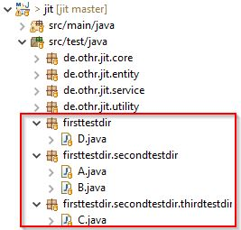

# Jit Source distributed version control system

This repo contains a simple Java-based version of git.
It basically offers git functionality to a limited extent.

## Features
1) initiate a new repository 

2) add (and remove) files to(from) the staging area 

3) commit added files 

4) check out former commits 

## How it works

- The Jit class can be called with optinal parameters 

- The class itself is stateless -> staging area is serialized 

- staging area builds a merkle tree 

- Hash nodes are computed from the content of its children 

## Examples

java Path.Jit init 

java Path.Jit add path/to/file 

java Path.Jit remove path/to/file 

java Path.Jit commit "message" 

java Path.jit checkout b5502597b61425d278f8aeac87e51a671a99e58a 

## JUnit testing

This project offers some JUnit tests. For testing purpose
, there are some dummy classes. 

Based on those classes, the workflow can be tested. This includes checking, 

wether the hash values have changed correctly.

## Contributing

If you'd like to contribute, please fork the repository and use a feature
branch. Pull requests are warmly welcome.

## Licensing

This project is licensed under GNU General Public License v3.0.